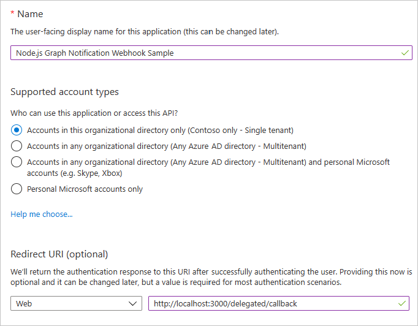

# Microsoft Graph Webhooks Sample for Node.js

[](https://github.com/microsoftgraph/nodejs-webhooks-sample/actions/workflows/nodejs.yml)

Subscribe for [Microsoft Graph change notifications](https://learn.microsoft.com/graph/api/resources/webhooks) to be notified when your user's data changes, so you don't have to poll for changes.

This sample NodeJS web application shows how to subscribe for change notifications as well as how to validate and decrypt change notifications with resource data when supported by the resource.

[User-delegated authentication](https://learn.microsoft.com/graph/auth-v2-user) represents a user and the application being used when calling the Microsoft Graph. This type of authentication is best suited for scenarios when the user interacts with the application. [Application only authentication](https://learn.microsoft.com/graph/auth-v2-service) represents only the application itself when calling the Microsoft Graph, without any notion of user. This type of authentication is best suited for background services, daemons or other kind of applications users are not directly interacting with.

> See the list of [permissions and authentication types](https://learn.microsoft.com/graph/api/subscription-post-subscriptions?view=graph-rest-1.0) permitted for each supported resource in Microsoft Graph.

The following are common tasks that an application performs with webhooks subscriptions:

- Get consent to subscribe to resources and then get an access token.
- Use the access token to [create a subscription](https://learn.microsoft.com/graph/api/subscription-post-subscriptions) to a resource.
- Send back a validation token to confirm the notification URL.
- Listen for notifications from Microsoft Graph and respond with a 202 status code.
- Request more information about changed resources using data in the notification if no data is provided with the notification.
- Decrypts the resource data provided with the notification if any has been provided with the notification.

## Using the Microsoft Graph Webhooks Sample

### Prerequisites

To use the Webhook sample, you need the following:

- [Node.js](https://nodejs.org/) version 18 or 20.
- A [work or school account](https://developer.microsoft.com/microsoft-365/dev-program).
- The application ID and key from the application that you [register on the Azure Portal](#register-the-app).
- A public HTTPS endpoint to receive and send HTTP requests. You can host this on Microsoft Azure or another service, or you can [use ngrok](#set-up-the-ngrok-proxy-optional) or a similar tool while testing.
- [OpenSSL](https://www.openssl.org/source/) when trying change notifications with resource data.

> You can install OpenSSL on windows using [chocolatey](https://chocolatey.org/install) with `choco install openssl -y` (run as administrator).

### Create your app

#### Choose the tenant where you want to create your app

1. Sign in to the [Azure Active Directory admin center](https://aad.portal.azure.com) using either a work or school account.
1. If your account is present in more than one Azure AD tenant:
    1. Select your profile from the menu on the top right corner of the page, and then **Switch directory**.
    1. Change your session to the Azure AD tenant where you want to create your application.

#### Register the app

1. Select **Azure Active Directory** in the left-hand navigation, then select [App registrations](https://go.microsoft.com/fwlink/?linkid=2083908) under **Manage**.

    

1. Select **New registration**. On the **Register an application** page, set the values as follows.

    - Set **Name** to `Node.js Graph Notification Webhook Sample`.
    - Set **Supported account types** to **Accounts in this organizational directory only**.
    - Under **Redirect URI**, set the first drop-down to `Web` and set the value to `http://localhost:3000/delegated/callback`.

    

1. Select **Register** to create the app. On the app's **Overview** page, copy the value of the **Application (client) ID** and **Directory (tenant) ID** and save them for later.

1. Select **Certificates & secrets** under **Manage**. Select the **New client secret** button. Enter a value in **Description** and select one of the options for **Expires** and select **Add**.

1. Copy the **Value** of the new secret **before** you leave this page. It will never be displayed again. Save the value for later.

    

1. Select **API permissions** under **Manage**.

1. In the list of pages for the app, select **API permissions**, then select **Add a permission**.

1. Make sure that the **Microsoft APIs** tab is selected, then select **Microsoft Graph**.

1. Select **Application permissions**, then find and enable the **ChannelMessage.Read.All** permission. Select **Add permissions** to add the enabled permission.

    > **Note:** To create subscriptions for other resources you need to select different permissions as documented [here](https://learn.microsoft.com/graph/api/subscription-post-subscriptions#permissions)

1. In the **Configured permissions** list, select the ellipses (`...`) in the **User.Read** row, and select **Remove permission**. The **User.Read** permission will be requested dynamically as part of the user sign-in process.

    

1. Select **Grant admin consent for `name of your organization`** and **Yes**. This grants consent to the permissions of the application registration you just created to the current organization.

### Set up the ngrok proxy (optional)

You must expose a public HTTPS endpoint to create a subscription and receive notifications from Microsoft Graph. While testing, you can use ngrok to temporarily allow messages from Microsoft Graph to tunnel to a *localhost* port on your computer.

You can use the ngrok web interface `http://127.0.0.1:4040` to inspect the HTTP traffic that passes through the tunnel. To download and learn more about using ngrok, see the [ngrok website](https://ngrok.com/).

1. Run the following command in your command-line interface (CLI) to start an ngrok session.

    ```Shell
    ngrok http 3000
    ```

1. Copy the HTTPS URL that's shown in the console. You'll use this to configure your notification URL in the sample.

    

    > **IMPORTANT**: Keep the console open while testing. If you close it, the tunnel also closes and you'll need to generate a new URL and update the sample. See [troubleshooting](./TROUBLESHOOTING.md) for more information about using tunnels.

### Configure and run the sample

1. Rename [sample.env](sample.env) to **.env** and open it in a text editor.

1. Replace `YOUR_CLIENT_ID_HERE` with the client ID of your registered Azure application.

1. Replace `YOUR_CLIENT_SECRET_HERE` with the client secret of your registered Azure application.

1. Replace `YOUR_TENANT_ID_HERE` with the tenant ID of your organization. This information can be found next to the client ID on the application management page, note: if you choose *Accounts in any organizational directory (Any Azure AD directory - Multitenant) and personal Microsoft accounts (e.g. Skype, Xbox)* replace this value for "common".

1. Replace `YOUR_NGROK_URL_HERE` with the HTTPS ngrok URL you copied earlier.

1. (Optional) - You can update the `CERTIFICATE_PATH`, `CERTIFICATE_ID`, `PRIVATE_KEY_PATH`, and `PRIVATE_KEY_PASSWORD` if desired.

1. (Optional) - If you are running the sample on Windows, you can provide a path to **openssl.exe** in the `WINDOWS_OPENSSL_PATH` value in **.env**.

1. Install the dependencies running the following command:

    ```Shell
    npm install
    ```

1. Start the application with the following command:

    ```Shell
    npm start
    ```

    > **Note:** You can also attach the debugger included in Microsoft Visual Studio Code using the included [launch.json](.vscode/launch.json). For more information, see [Node.js debugging in VS Code](https://code.visualstudio.com/docs/nodejs/nodejs-debugging).

1. Open a browser and go to [http://localhost:3000](http://localhost:3000).

### Use the app to create a subscription

#### Use delegated authentication to subscribe to a user's inbox

1. Choose the **Sign in and subscribe** button and sign in with a work or school account.

1. Review and consent to the requested permissions. The subscription is created and you are redirected to a page displaying any notification being received.

1. Send an email to yourself. A notification appears showing the subject and message ID.

    

#### Use app-only authentication to subscribe to Teams channel messages

1. If you previously subscribed to a user's inbox, choose the **Delete subscription** button to return to the home page.

1. Choose the **Subscribe** button. The subscription is created and you are redirected to a page displaying any notification being received.

1. Post a message to a channel in any team in Microsoft Teams. A notification appears showing the sender's name and the message.

    

## Troubleshooting

See the dedicated [troubleshooting page](./TROUBLESHOOTING.md).

## Contributing

If you'd like to contribute to this sample, see [CONTRIBUTING.MD](/CONTRIBUTING.md).

This project has adopted the [Microsoft Open Source Code of Conduct](https://opensource.microsoft.com/codeofconduct/). For more information see the [Code of Conduct FAQ](https://opensource.microsoft.com/codeofconduct/faq/) or contact [opencode@microsoft.com](mailto:opencode@microsoft.com) with any additional questions or comments.

## Questions and comments

We'd love to get your feedback about the Microsoft Graph Webhook sample. You can send your questions and suggestions to us in the [Issues](https://github.com/microsoftgraph/nodejs-webhooks-rest-sample/issues) section of this repository.

Questions about Microsoft Graph in general should be posted to [Microsoft Q&A](https://learn.microsoft.com/answers/products/graph). Make sure that your questions or comments are tagged with the relevant Microsoft Graph tag.

## Additional resources

- [Microsoft Graph Webhooks sample for ASP.NET core](https://github.com/microsoftgraph/aspnetcore-webhooks-sample)
- [Microsoft Graph Webhooks sample for Java Spring](https://github.com/microsoftgraph/java-spring-webhooks-sample)
- [Working with Webhooks in Microsoft Graph](https://learn.microsoft.com/graph/api/resources/webhooks)
- [Subscription resource](https://learn.microsoft.com/graph/api/resources/subscription)
- [Microsoft Graph documentation](https://learn.microsoft.com/graph)
